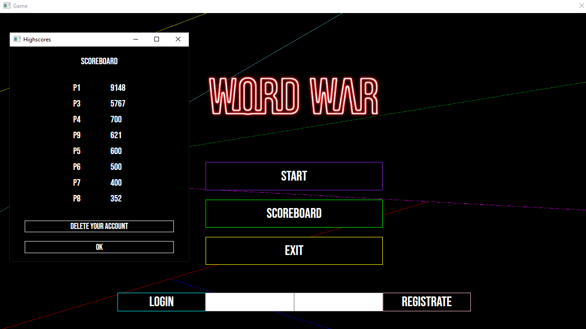
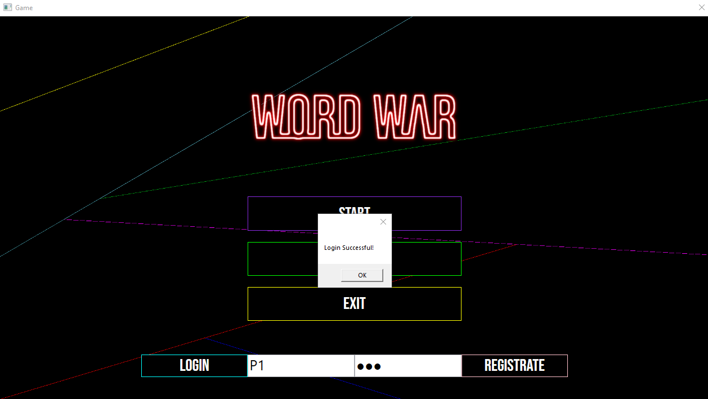
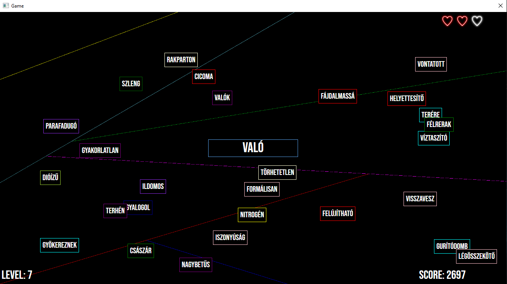
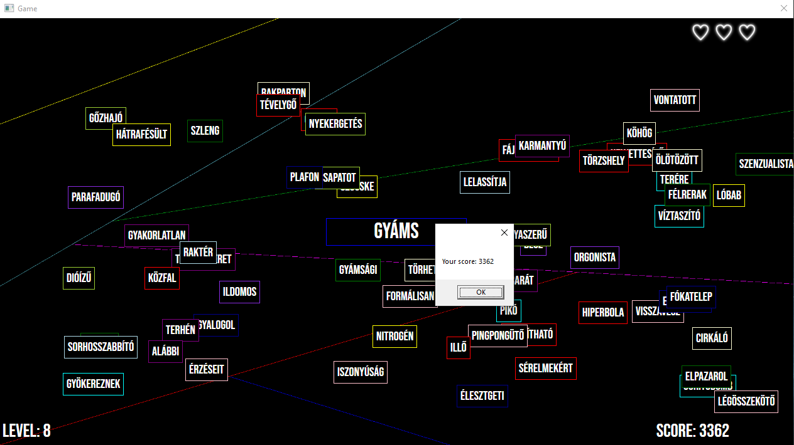

## WPF Game - Word War

I had to create a little **WPF** appliciation and I also had to use  **REST API** so I made this little game that I call Word War. It is that kind of typing game where you have to type in the right world to get points. I did use REST API for the highscore, registration, login validation and for delete an account.

Some screenshot about the game:

