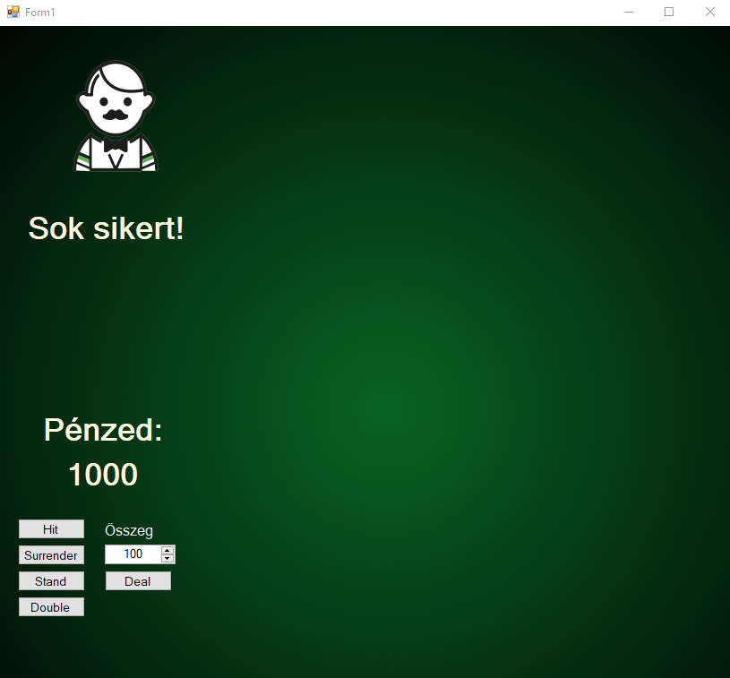
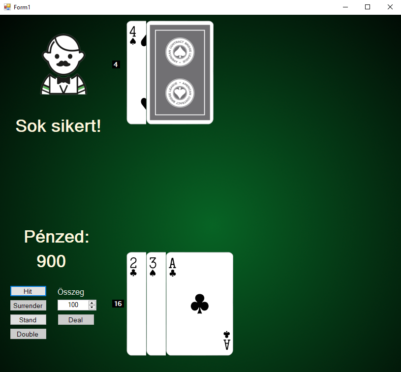
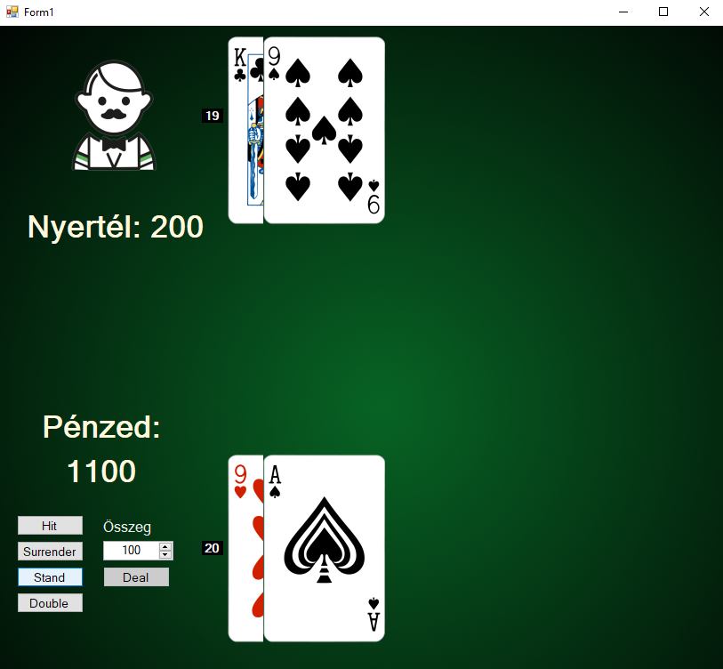
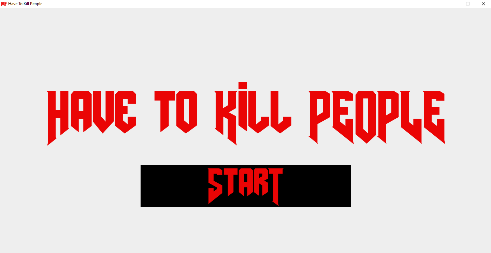
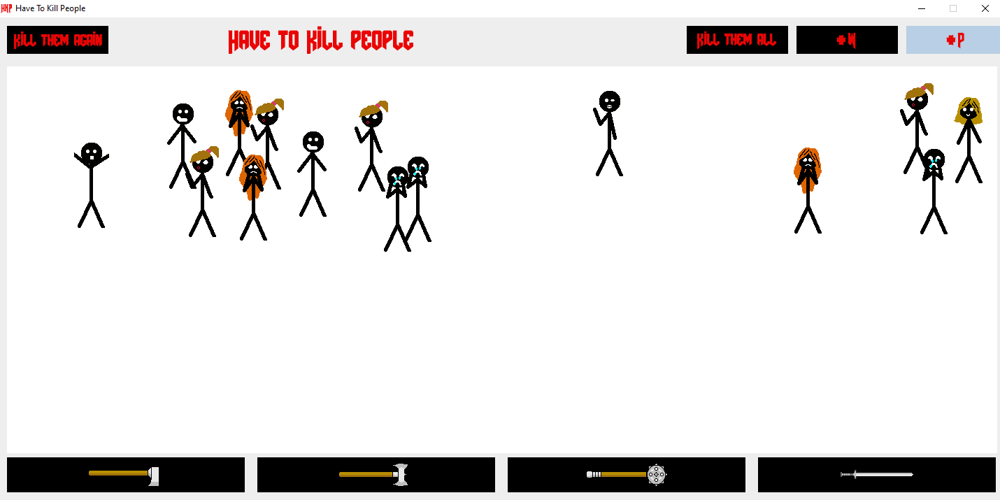
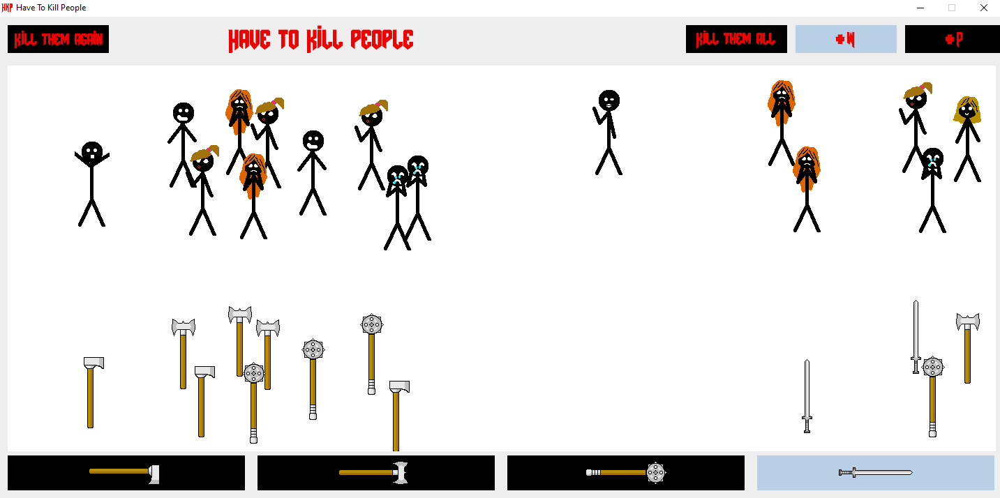
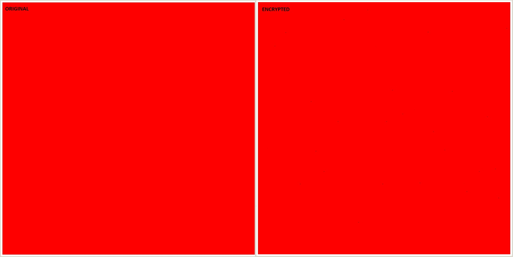
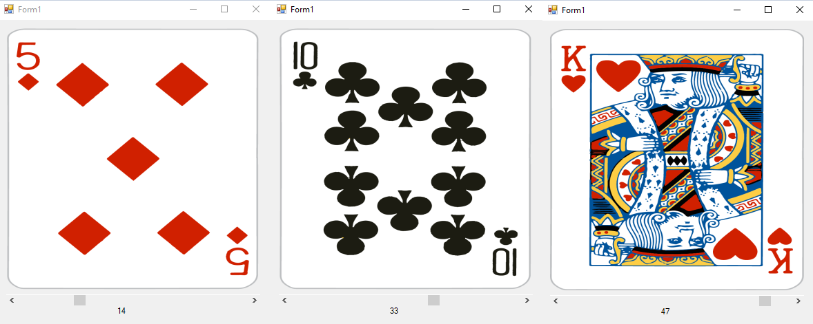
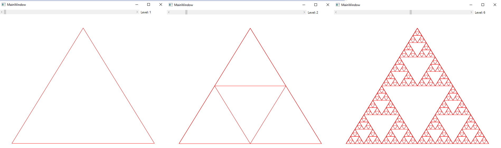
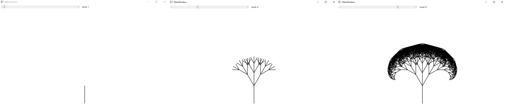

# Projects for school

Here you can check my projects which were created to the school. They are not perfect, sometimes I had not got enough time to make them nice and clean and some of them was never finished.

## BlackJack

It was one of my hardest task at the university. I had to create an application which use **GRPC** and I choosed BlackJack. I do not know why but I wrote the whole program in **Windows forms** and it was not clean at all. I suffered a lot with it I had lots of problem that I did not expect but in the end it worked. So there is a server which represent the dealer and when you connect to the server you going to play on an independent **thread** so several user can play the game at the same time . The user details and their score going to be stored on an **Oracle Database**.

Unfortunately I could not make screenshots about the version with GRPC. Before it I made the whole project in a simple WPF. It is very similar just in the one with GRPC you can registrate and login, and you can see the server's highscore list.

## WPF Game - Word War

I had to create a little **WPF** appliciation and I also had to use  **REST API** so I made this little game that I call Word War. It is that kind of typing game where you have to type in the right world to get points. I did use REST API for the highscore, registration, login validation and for delete an account.

Some screenshot about the game:

## Java Game - Have To Kill People

We learnt about the **clean coding**, **design patterns** so we had to represent our knowledge with a little java application. I know that we should to practice clean coding here but to be honest in the last 2 years I did not use java so I forgot a lot however I did this. I know it looks like wierd but I can explain that. I heard that sentence from a girl in youtube video where she played with an FPS game and It was so funny and I am a really bad designer so I needed some motivation. 

So we had to implement at least two pattern in this project. I used the **builder pattern** to build up those stickmans. It can be male or female and there is 4 style with each gender. They also have names but you can only see it in the logs. Yes, we had to log every action. The other pattern was the **prototype pattern** that I used for to display the weapons. I also had to use **MVVM** model and there is it. A little stress relief game.

Some screenshot about the game:

## Cryptography - Image Coding

We had a course about **Cryptography** and the teacher give up an optional task for better grade so I made it. I had to the write a program for encrypt messages with using the image pixels color code. I converted the message in an ascii code array and I changed the red color value with the amount of the ascii code value. After the encryption if we substract the the original pixels from the encrypted pixels the absolute value of the difference going to be the ascii code where the result is not zero. If I take these valuse and convert it back we got the original message.

## French Cards

I wanted to be sure about the cards img importation works well for the BlackJack project, so I made this little **WPF** applications where we can go through the cards.

## Recursion - Sierpiński

Here we learnt about the recusions and made this little **WPF** to visualize that how **recursion** does work and the Sierpiński triangle is perfect for that. You can see the results:

## Recursion - Tree

It was a homework that we could do a simillar task as the Sierpiński triangle just with trees so I did it. Results:

## Bus Company

I created this project for a course where we learnt about the basics of **OOP**.  It is just a simple console application.

## Thread Demo

There I just tried to get to know how **thread**s are working.

## Unit Test Demo

Also a little demo application where I am trying to do **unit test**s.